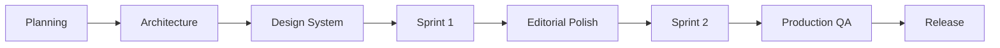

<div align="center">

# Lucas Calzoni

### Production-Ready Portfolio Website

A modern portfolio website engineered with a strong focus on performance, accessibility, maintainability and long-term scalability.

<p>

[Live Demo](#) ·
[Documentation](./docs) ·
[License](./LICENSE)

</p>

---

**React** • **TypeScript** • **Vite** • **Tailwind CSS v4** • **shadcn/ui**


</div>

---

> [!NOTE]
> This repository is intentionally documented as an engineering case study. Beyond showcasing the final application, it documents the architectural decisions, development workflow and quality standards that guided the project from planning to release.

---

# Overview

This repository contains the source code for the official portfolio website of actor **Lucas Calzoni**.

Although the final product is a portfolio website, the project was intentionally developed using production-oriented frontend engineering practices instead of rapid prototyping.

The primary goal was not simply to deliver a visually appealing interface, but to build a codebase that is:

- maintainable
- scalable
- accessible
- predictable
- easy to evolve

Every significant implementation decision was documented before development, allowing the application to grow through controlled iterations rather than continuous refactoring.

---

# Engineering Highlights

| | |
|:--|:--|
| **Architecture** | Component-first architecture with clear separation of concerns |
| **Development** | Documentation-first workflow |
| **Codebase** | Fully written in TypeScript |
| **Styling** | Tailwind CSS v4 + reusable UI primitives |
| **Internationalization** | Content-driven bilingual architecture |
| **Accessibility** | Semantic HTML and keyboard-friendly navigation |
| **Quality** | ESLint, production validation and browser QA |
| **Deployment Target** | Static hosting (Cloudflare Pages, Vercel or Netlify) |

---

# Why This Project?

Modern frontend applications are expected to satisfy much more than visual requirements.

They must also provide:

- predictable architecture;
- responsive user experience;
- accessibility;
- maintainable source code;
- scalable organization;
- production reliability.

This project was developed with those goals from the very beginning.

Rather than treating engineering quality as a final polishing step, quality considerations accompanied the implementation throughout the entire lifecycle.

---

# Core Principles

The project is built around a small set of engineering principles that guided every implementation decision.

| Principle | Description |
|-----------|-------------|
| **Documentation First** | Major decisions are documented before implementation begins. |
| **Component First** | Interfaces are composed from isolated, reusable building blocks. |
| **Accessibility by Default** | Accessibility is considered during implementation, not after it. |
| **Performance Awareness** | Stable rendering and efficient delivery are preferred over unnecessary complexity. |
| **Separation of Concerns** | Content, presentation, styling and utilities remain independent whenever possible. |
| **Incremental Delivery** | The project evolved through controlled milestones instead of large rewrites. |

---

# Technology Stack

| Category | Technology |
|-----------|------------|
| Framework | React |
| Language | TypeScript |
| Build Tool | Vite |
| Styling | Tailwind CSS v4 |
| UI Components | shadcn/ui |
| Icons | Lucide React |
| Linting | ESLint |
| Formatting | Prettier |
| Package Manager | npm |

---

# Design Decisions

Technology choices were made with long-term maintainability in mind rather than popularity alone.

## Why React?

React provides a mature component model with excellent ecosystem support, making it a reliable foundation for long-lived frontend projects.

---

## Why Vite?

Vite offers an extremely fast development experience while producing highly optimized production builds with minimal configuration.

---

## Why TypeScript?

TypeScript improves maintainability by making application contracts explicit and reducing an entire class of runtime errors before deployment.

---

## Why Tailwind CSS v4?

Tailwind enables a consistent design language while avoiding large, difficult-to-maintain stylesheet hierarchies.

Using utility-first styling also encourages component isolation and predictable visual composition.

---

## Why shadcn/ui?

Rather than relying on opaque component libraries, shadcn/ui provides reusable building blocks that remain fully owned by the project.

This keeps customization straightforward while avoiding unnecessary abstraction.

---

## Why Content-driven Internationalization?

Instead of embedding text directly into components, localized content is stored independently.

This architecture makes adding new languages significantly easier while keeping presentation components focused solely on rendering.

---

## Why Documentation-first?

The project intentionally treats documentation as part of the software itself.

Architecture, design decisions and implementation planning were established before coding, reducing uncertainty and improving consistency throughout development.

---

# Project Architecture

Instead of concentrating responsibilities into a few large files, the application follows a layered component architecture.

```text
Application
│
├── Layout
│   ├── Navigation
│   ├── Footer
│   └── Shared Layout
│
├── Sections
│   ├── Hero
│   ├── About
│   ├── Work
│   ├── Gallery
│   └── Contact
│
├── UI Components
│
├── Localized Content
│
├── Shared Data
│
└── Utilities
```

Each layer has a single responsibility, reducing coupling between different parts of the application.

This organization makes future maintenance considerably easier while supporting long-term scalability.

---

# Project Structure

```text
.
├── docs/
├── public/
│   └── assets/
├── src/
│   ├── components/
│   │   ├── layout/
│   │   ├── sections/
│   │   └── ui/
│   ├── content/
│   ├── data/
│   ├── lib/
│   ├── App.tsx
│   ├── main.tsx
│   └── index.css
│
├── package.json
├── vite.config.ts
└── README.md
```

Rather than organizing files solely by feature, the repository separates concerns into focused modules, improving discoverability and reducing maintenance complexity.

---

# Engineering Workflow

The application was developed using an iterative, documentation-first workflow designed to reduce uncertainty and keep implementation decisions intentional.

Rather than coding every feature immediately, the project progressed through well-defined milestones, with each phase concluding in validation before moving to the next.



This incremental approach allowed architectural decisions, visual refinements and quality improvements to evolve independently without introducing unnecessary technical debt.

---

# Development Lifecycle

Each milestone had a clearly defined objective before implementation began.

| Phase | Goal |
|--------|------|
| **Planning** | Define project scope, information architecture and implementation strategy. |
| **Architecture** | Organize project structure and component responsibilities. |
| **Design System** | Establish reusable UI patterns and visual consistency. |
| **Sprint 1** | Deliver the first functional implementation. |
| **Editorial Polish** | Refine typography, spacing, visual hierarchy and content. |
| **Sprint 2** | Address remaining improvements and production adjustments. |
| **Production QA** | Validate accessibility, responsiveness, performance and browser compatibility. |
| **Release** | Prepare the repository for public deployment. |

---

# Documentation-first Development

One of the guiding principles of this project was treating documentation as part of the implementation process.

Major architectural and design decisions were documented before writing production code whenever possible.

This approach provided several advantages:

- reduced implementation uncertainty;
- more consistent component design;
- easier future maintenance;
- fewer large-scale refactors;
- clearer project history.

The goal was not simply to document the project after completion, but to use documentation as an engineering tool throughout development.

---

# Component-first Architecture

Every section of the application was designed as an isolated, reusable component.

```text
Page
│
├── Layout
│
├── Hero
├── About
├── Work
├── Gallery
├── Contact
│
└── Shared UI Components
```

Keeping sections independent minimizes coupling and allows individual areas of the application to evolve without affecting unrelated components.

This also simplifies testing, maintenance and future feature additions.

---

# AI-assisted Engineering

Artificial intelligence was used as an engineering accelerator rather than a replacement for software engineering judgment.

AI assisted with planning, implementation support and iterative refinement, while architectural decisions and production approval remained human-reviewed.

| Activity | AI Assisted | Human Reviewed |
|-----------|:----------:|:--------------:|
| Project planning | ✅ | ✅ |
| Architecture discussions | ✅ | ✅ |
| Component implementation | ✅ | ✅ |
| Documentation | ✅ | ✅ |
| Quality Assurance | ✅ | ✅ |
| Production approval | ❌ | ✅ |

The objective was to increase development efficiency without compromising code quality or maintainability.

---

# Quality Gates

Every milestone concluded with explicit validation before progressing to the next phase.

The following quality gates were applied throughout the project:

| Category | Validation |
|----------|------------|
| Code Quality | ESLint validation |
| Type Safety | TypeScript compilation |
| Production Build | Successful production build |
| Accessibility | Semantic HTML and keyboard navigation |
| Responsive Design | Desktop and mobile validation |
| Browser Testing | Chrome DevTools inspection |
| Runtime Validation | Console and network verification |
| Visual Review | Editorial and UI consistency review |

Only after all quality gates were satisfied was the project considered ready for deployment.

---

# Accessibility

Accessibility was treated as an implementation requirement rather than a post-development enhancement.

The project emphasizes:

- semantic HTML structure;
- keyboard-friendly navigation;
- accessible interactive elements;
- sufficient visual hierarchy;
- responsive layouts across multiple viewport sizes.

These decisions improve usability while contributing to long-term maintainability.

---

# Performance

Performance considerations were incorporated throughout development instead of being deferred until the end.

Examples include:

- optimized production builds through Vite;
- responsive image handling;
- layout stability improvements;
- reduced unnecessary rendering;
- lightweight component composition.

The objective was to provide a fast browsing experience without introducing premature optimization or unnecessary complexity.

---

# Browser Validation

Before release, the application underwent manual validation using Chrome DevTools.

The final review included verification of:

- console output;
- network requests;
- rendering behavior;
- layout consistency;
- responsive breakpoints;
- accessibility warnings;
- production build behavior.

This manual inspection complements automated tooling by identifying issues that static analysis cannot detect.

---

# Repository Standards

To improve long-term maintainability, the repository follows a small set of structural conventions.

| Guideline | Purpose |
|-----------|---------|
| Small reusable components | Improve maintainability |
| Localized content separated from UI | Simplify translations |
| Shared utilities isolated | Reduce duplication |
| Consistent naming | Improve discoverability |
| Documentation alongside implementation | Preserve engineering context |

These conventions help keep the codebase approachable as it grows.

---

# Engineering Philosophy

The project prioritizes long-term software quality over rapid feature delivery.

Several engineering principles influenced the implementation:

- simplicity over unnecessary abstraction;
- readability over cleverness;
- consistency over shortcuts;
- maintainability over premature optimization;
- incremental improvement over large rewrites.

Although the application itself is intentionally lightweight, the engineering process reflects the same standards commonly applied to larger production systems.

---

# Getting Started

## Prerequisites

Before running the project locally, ensure you have the following installed:

- Node.js 20+
- npm

---

## Installation

Clone the repository:

```bash
git clone https://github.com/WillGalvaoDev/lucas-calzoni.git
```

Navigate to the project directory:

```bash
cd lucas-calzoni
```

Install dependencies:

```bash
npm install
```

Start the development server:

```bash
npm run dev
```

The application will be available at:

```
http://localhost:5173
```

---

# Available Scripts

| Command | Description |
|----------|-------------|
| `npm run dev` | Starts the local development server |
| `npm run build` | Creates an optimized production build |
| `npm run preview` | Serves the production build locally |
| `npm run lint` | Runs ESLint across the project |

---

# Production Build

Generate the production bundle with:

```bash
npm run build
```

The compiled application will be generated inside the `dist/` directory and is ready for deployment to any static hosting provider.

---

# Deployment

The project is designed for modern static hosting platforms.

Supported deployment targets include:

- Cloudflare Pages
- Vercel
- Netlify
- GitHub Pages

Since the application is built with Vite, deployment requires no server-side runtime.

---

# Documentation

Additional documentation is available in the `/docs` directory.

The documentation includes architectural notes, implementation decisions and project evolution throughout development.

Documentation is treated as part of the software rather than supplementary material.

---

# Roadmap

Although the current version is considered production-ready, several improvements remain possible.

Potential future enhancements include:

- additional language support;
- automated accessibility testing;
- end-to-end testing;
- CI/CD workflows;
- performance monitoring;
- analytics integration;
- CMS-backed content management.

The current architecture was intentionally designed to accommodate these additions without significant restructuring.

---

# Contributing

At the moment, this repository is maintained as a personal project.

Suggestions, issues and constructive feedback are always welcome.

If you discover a bug or have an idea for improvement, feel free to open an issue or submit a pull request.

---

# Lessons Learned

This project reinforced several engineering principles that extend beyond the application itself.

Some of the most valuable outcomes include:

- investing in architecture before implementation reduces future complexity;
- documentation significantly improves long-term maintainability;
- incremental delivery encourages better decision-making;
- small, isolated components are easier to maintain than large abstractions;
- quality is achieved through continuous validation rather than a final review.

These lessons will continue influencing future projects built with the same engineering philosophy.

---

# Acknowledgements

This project benefited from the excellent open-source ecosystem surrounding the modern React community.

Special thanks to the maintainers of:

- React
- Vite
- Tailwind CSS
- shadcn/ui
- Lucide
- TypeScript

whose work enables developers to build high-quality applications with confidence.

---

# Repository Philosophy

The purpose of this repository extends beyond presenting a finished website.

It also serves as an example of how documentation, architecture and iterative development can work together to produce maintainable software.

Every significant decision was made with long-term readability, scalability and consistency in mind.

Rather than optimizing exclusively for speed, the project prioritizes engineering quality throughout its lifecycle.

---

# Author

**Will Galvão**

Software Engineer focused on modern web development, frontend architecture and AI-assisted software engineering.

GitHub:

```
https://github.com/WillGalvaoDev
```

---

<div align="center">

Built with care, documented with intention and engineered for long-term maintainability.

</div>